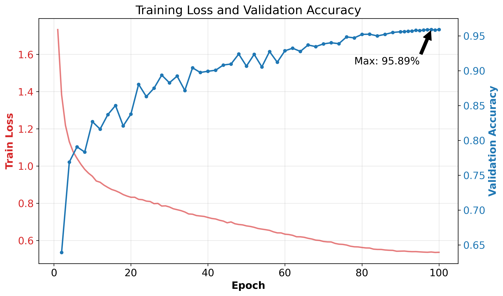

# CIFAR-10 High-Performance ResNet-18 (95.89%)

[](https://pytorch.org/)
[](LICENSE)

This repository contains a PyTorch implementation of a modified **ResNet-18** designed specifically for the CIFAR-10 dataset. By refactoring the input stem to preserve high-resolution features and applying strong regularization strategies, this model achieves **95.89%** accuracy and **0.9589** F1-Score on the test set without any external pre-training.

## 🏆 Results

| Metric | Value |
| :--- | :--- |
| **Best Accuracy** | **95.89%** |
| **Macro F1-Score** | **0.9589** |
| **Parameters** | ~11.2M |
| **Epochs** | 100 |

### Training Curve

*Figure 1: Training Loss and Validation Accuracy over 100 epochs.*

### Prediction Visualization

*Figure 2: Sample predictions on the test set. Green indicates correct predictions, red indicates errors.*

## 🚀 Key Features

### 1. Architectural Adaptations (Input Stem)
Standard ResNet-18 is designed for ImageNet (224x224). Applying it directly to CIFAR-10 (32x32) results in severe information loss due to early downsampling.
- **Modification:** Replaced the initial $7\times7$ convolution (stride 2) and MaxPool with a single $3\times3$ convolution (stride 1).
- **Benefit:** Preserves the $32\times32$ spatial resolution before entering the residual blocks.

### 2. Strong Regularization
To prevent overfitting on the 11M parameter model:
- **Data Augmentation:** Random Crop, Horizontal Flip, and **Random Erasing**.
- **Dropout:** Added a Dropout layer ($p=0.5$) before the final classifier.
- **Weight Decay:** set to `1e-2`.
- **Label Smoothing:** $\epsilon=0.1$ to prevent over-confidence.

### 3. Optimization Strategy
- **Optimizer:** AdamW.
- **Scheduler:** `OneCycleLR` (Max LR = 0.01). This allows for super-convergence, reaching high accuracy in fewer epochs.

## 📂 Project Structure

```text
├── plots/          # Images for README (plots, visualisations)
├── cfDatasets.py       # Data loading and augmentation pipeline
├── model.py            # Modified ResNet-18 architecture
├── train.py            # Main training loop
├── test.py             # Inference and visualization script
├── plot.py             # Plotting tool for training logs
└── README.md           # Project documentation
